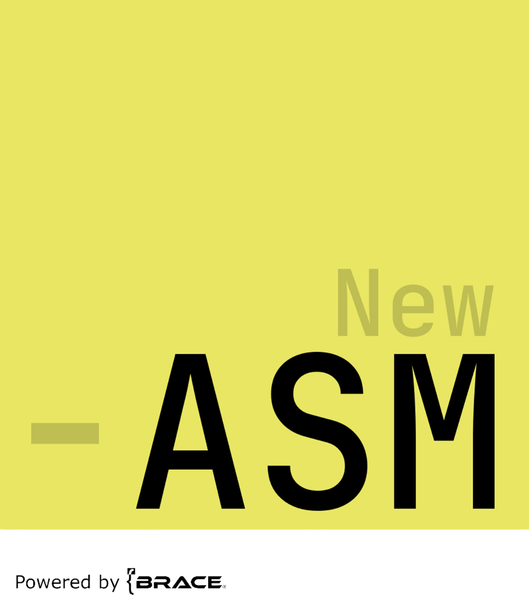

<div align="center">
    
</div>

<h1 align = "center">Welcome to the <i><b>NewASM</b></i> Wiki</h1>

<div align="center" style="border-radius: 5px;">
    <h3></h3>


</div>

<h3 align = "center">Interpreted Low-Level Language that Mimics Assembly</h3>

**NewASM** is an interpreted low-level programming language which combines explicit memory and register control, giving it a breeze of assembly-like feel, with high-level functionalities such as objects, threads and more.

> [!NOTE]
> **NewASM** language runs inside a NewASM Virtual Machine.

# Documentation
Below is the simple `Hello World` program written in New-Assembly.

```asm
using "ios"
.data
    string text : "Hello world\n"
    intg len : $-text
.start
    mov tlr, text
    mov fdx, 1
    mov bos, len

    sysenter "ios"
    
    syscall

    ret 0
```
> [!WARNING]
> The wiki is being completely reworked, so it may be missing some stuff.

NewASM allows you to write semi-efficient low-level programs in one universal assembly-like language. This language features many things immediatelly out-of-the-box *such as concurrency, thread channels, basic crypto, file, math and console functionality, etc.*, so you do not have to worry about any library installation. However, if you wish to add any new functionality, you can easily integrate dynamic libraries (DLLs, SOs) into your project.

Since NewASM runs in a virtual machine, it is thus running in a fully controlled sealed environment, so it is great for learning and experimenting.

# Table of contents
- [Using the executeable](#using-the-executeable)
    - [Launch modes](#launch-modes)
        - [Shell mode](#shell-mode)
        - [Interpreter mode](#interpreter-mode)
- [The language](#the-language)

## Using the executeable
NewASM build consists of 2 programs, `newasm` and `nprogwin`. What YOU need is the `newasm` executable file which may be run in 2 modes.
Arguments are provided using the `newasm_args` variable you create before running the executeable, ergo:
1. Windows
```bat
set newasm_args=arg1,arg2
```
2. Linux
```bash
export newasm_args=arg1,arg2
```

| Argument | Parameters | Description |
| ---------------- | --------- | ----------- |
| `h` | - | Displays help about these commands. |
| `l` | - | Turn on the logging system. |
| `nv` | - | Disable version checking. |
| `std` | - | Use the standard library. |
| `nodbg` | - | Disable the debug window. |

Example:
```bat
set newasm_args=l,h,std
```

### Launch modes
When running the `newasm` executeable, you can run it in 2 different modes:
* **interpreter**: this is the default interpreter mode, it just does the primary idea of what it is supposed to do - run the assembly code;
* **shell**: this is the shell, or control console, mode - application will run as the command prompt with its own commands, you can install packages and maintain your project.

To run the interpreter, use `newasm <filename>.asm`, but to run the shell, just run the `newasm` app.

***

#### Shell mode
Shell mode brings new different commands with it. Below is a list of available commands:
| Command | Arguments | Description |
| ---------------- | --------- | ----------- |
| `help` | - | Displays this panel within the console. |
| `exit` | - | Closes the application. |
| `repl` | - | Enter the read-evaluate-print console. |
| `install` | `<lib>` | Install a library online (currently there's no libraries that are available!). |
| `login` | - | Log into your local account. |
| `logout` | - | Log out of your local account. |
| `addenv` | - | Adds an environment variable. |
| `remenv` | - | Deletes an environment variable. |
| `modenv` | - | Modifies the environment variable. |
| `renenv` | - | Changes the variable name. |
| `printenv` | - | Prints all the environment variables. |
| `passwd` | - | Change your password. |
| `usernm` | - | Change your username. |

#### Interpreter mode
Interpreter mode runs your application through several phases.
1. **Linker phase**: In this phase, the linker links all files included in the application into one internal format.
2. **Internal compilation**: In this phase, the system tokenizes and resolves some compile-time stuff before running the program. This ensures safe and stable program execution. In this phase, the system is telling the virtual machine what kernel modules will be used during the execution of the program.
3. **Execution**: Final phase, the system runs the compiled code!

> [!TIP]
> We're planning to add JIT compilation into native code, but that's in the testing phase.
***
## The language
This section of the wiki provides a deep walkthrough of the language itself.
### Table of contents
- [Code sections](#code-sections)
- [Available instructions](#available-instructions)
- [Storing data into variables and containers](#storing-data-into-variables-and-containers)
- [Language concepts](#language-concepts)
***
#### Code sections
NewASM code is, as in other assemblers, divided into different sections that have their own syntax.
There are 4 different sections and each one has a different purpose:
1. `.start` - this is the code section that contains functional code (instructions), can contain procedure (function) and thread definitions;
2. `.data` - this is where you declare your variables, references, containers, and more;
3. `.text` - this is where you declare macros;
4. `.hndl` - in this section, you assign procedures their own hex codes you can use in call stack.

You change a section by doing:
```asm
.section_name
```

For example:

```asm
.start
    ; code
.data
    ; declarations
    ; etc...
```

***
#### Available instructions
NewASM features many instructions, around 70 of them. Here is a list:
1. [Data manipulation instructions](docs/instructions/data_manip.md)
2. [Manual memory allocation instructions](docs/instructions/malloc.md)
3. [Kernel-related instructions](docs/instructions/kernel.md)
4. [Execution flow instructions](docs/instructions/exec_flow.md)
5. [Miscellaneous instructions](docs/instructions/misc.md)
5. [Mathematical instructions](docs/instructions/math.md)

***
#### Storing data into variables and containers
In NewASM there's a huge variety of built in variable types and data containers, with standard variables coming soon (as soon as we figure out the appropriate syntax!).
1. DOCS REWORK COMING SOON!

***
#### Language concepts
NewASM features different concepts such as decorators, namespaces, primitive classes and more advanced stuff.
1. DOCS REWORK COMING SOON!